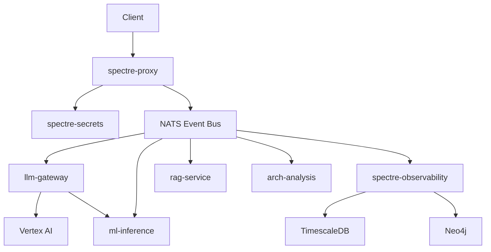

# SPECTRE Fleet - Next Steps

**Current Phase**: 0 (Foundation) - Complete ✅
**Ready For**: Test Validation & Phase 1 Planning

---

## 🎯 Immediate Actions (Today)

### 1. ⏳ Validate Phase 0 Completion

**Priority**: CRITICAL
**Time**: 10 minutes

```bash
# Clean any previous containers
docker-compose down -v

# Run full test suite
./scripts/run-tests.sh

# Expected: All tests pass (30/30)
```

**Success Criteria**:
- ✅ Infrastructure starts (NATS, TimescaleDB, Neo4j)
- ✅ All 30 tests pass
- ✅ No clippy warnings
- ✅ Code formatted correctly

**If Tests Fail**: Check logs in `/tmp/spectre-test-*.log`

---

### 2. ⏳ Capture Performance Baseline

**Priority**: HIGH
**Time**: 5 minutes

```bash
# Run performance test
cargo test --test test_event_bus test_10_batch_publish_performance -- --nocapture

# Record output:
# - Events published: 100
# - Duration: ~X seconds
# - Throughput: ~X events/sec
```

**Document Results** in `PERFORMANCE.md`:
```markdown
## Baseline (Phase 0)
- Date: 2026-01-08
- Environment: NixOS, NATS 2.10, Rust 1.92.0
- Event Publish Throughput: X events/sec
- Event Publish Latency: X ms average
```

---

### 3. 🎨 Create Architecture Diagram (Optional)

**Priority**: MEDIUM
**Time**: 20 minutes

Add Mermaid diagram to `README.md`:



---

## 📅 Phase 1: Security Infrastructure (Week 3-4)

### Week 3: spectre-secrets

#### Day 1-2: Core Implementation

**Tasks**:
1. Create `crates/spectre-secrets/` structure
2. Extract crypto from `cognitive-vault/core/`
3. Implement secret storage (AES-GCM encryption)
4. Implement secret retrieval

**Files to Create**:
```
crates/spectre-secrets/
├── Cargo.toml
└── src/
    ├── lib.rs          # Public API
    ├── storage.rs      # Secret storage
    ├── crypto.rs       # Encryption utils
    └── types.rs        # Secret, SecretId types
```

**Tests**:
```bash
cargo test -p spectre-secrets
```

#### Day 3: Rotation Logic

**Tasks**:
1. Implement rotation policies (time-based, manual)
2. Add rotation event publishing to NATS
3. Add rotation history tracking

**Files to Create**:
```
src/rotation.rs     # Rotation policies
src/events.rs       # NATS integration
```

**Tests**:
- [ ] Manual rotation trigger
- [ ] Automatic rotation (30-day policy)
- [ ] Rotation event published to NATS

#### Day 4: Integration with cognitive-vault

**Tasks**:
1. Link with `cognitive-vault/core` Cargo.toml
2. Use existing crypto primitives (Argon2, AES-GCM)
3. Write integration tests

**Dependencies**:
```toml
[dependencies]
cognitive-vault-core = { path = "../../cognitive-vault/core" }
```

---

### Week 4: spectre-proxy

#### Day 5-6: Gateway Implementation

**Tasks**:
1. Create `crates/spectre-proxy/` structure
2. Setup Axum HTTP server
3. Extract TLS code from `securellm-bridge`
4. Implement request routing to NATS

**Files to Create**:
```
crates/spectre-proxy/
├── Cargo.toml
└── src/
    ├── lib.rs          # Public API
    ├── gateway.rs      # Axum server
    ├── routes.rs       # HTTP routes
    └── tls.rs          # TLS setup
```

**Test**:
```bash
# Start proxy
cargo run -p spectre-proxy

# Test HTTP → NATS routing
curl http://localhost:8080/api/v1/llm/request -d '{"prompt": "test"}'
```

#### Day 7-8: Authentication & Rate Limiting

**Tasks**:
1. Implement authentication middleware (uses spectre-secrets)
2. Implement rate limiting (Token Bucket)
3. Implement circuit breakers

**Files to Create**:
```
src/auth.rs         # Auth middleware
src/rate_limit.rs   # Rate limiter
src/circuit.rs      # Circuit breaker
```

**Tests**:
- [ ] Valid auth token → request proceeds
- [ ] Invalid auth token → 401 Unauthorized
- [ ] Rate limit exceeded → 429 Too Many Requests
- [ ] Circuit breaker opens after 5 failures

#### Day 9-10: Integration & E2E Tests

**Tasks**:
1. E2E test: HTTP → Proxy → NATS → Service → Response
2. Performance test: Proxy overhead measurement
3. Security test: TLS, authentication, rate limiting

**Files to Create**:
```
tests/integration/test_proxy.rs        # Proxy integration tests
tests/integration/test_security.rs     # Security tests
```

**Expected Performance**:
- Proxy overhead: < 50ms p99
- TLS handshake: < 100ms
- Rate limiting: negligible overhead

---

## 🗓️ Week-by-Week Breakdown

### Week 3 (Days 15-21)

| Day | Focus | Deliverable |
|-----|-------|-------------|
| 15 | spectre-secrets structure | Crate created, Cargo.toml |
| 16 | Secret storage | CRUD operations work |
| 17 | Rotation logic | Manual + automatic rotation |
| 18 | cognitive-vault integration | Uses existing crypto |
| 19 | Testing & docs | Tests pass, rustdoc complete |
| 20-21 | Buffer / refinement | Polish, performance tuning |

### Week 4 (Days 22-28)

| Day | Focus | Deliverable |
|-----|-------|-------------|
| 22 | spectre-proxy structure | Crate created, Axum setup |
| 23 | Gateway & routing | HTTP → NATS works |
| 24 | TLS setup | Secure connections |
| 25 | Authentication | Auth middleware works |
| 26 | Rate limiting | Token bucket implemented |
| 27 | Circuit breakers | Failover logic works |
| 28 | E2E tests | Full flow tested |

---

## 🎯 Phase 1 Acceptance Criteria

### Must Have ✅
- [ ] spectre-secrets encrypts/decrypts secrets
- [ ] spectre-secrets rotates secrets (manual + automatic)
- [ ] spectre-proxy accepts HTTP requests
- [ ] spectre-proxy validates auth tokens (via spectre-secrets)
- [ ] spectre-proxy routes requests to NATS
- [ ] spectre-proxy implements rate limiting
- [ ] spectre-proxy implements circuit breakers
- [ ] End-to-end test passes: HTTP → Proxy → NATS → Service
- [ ] TLS works for external connections
- [ ] All tests pass (unit + integration)

### Should Have 🎯
- [ ] Performance: Proxy overhead < 50ms p99
- [ ] Metrics: Prometheus exporters for both services
- [ ] Docs: Architecture diagrams in Mermaid
- [ ] Docs: API documentation (OpenAPI spec)

### Nice to Have 💡
- [ ] WebSocket support in proxy
- [ ] gRPC support in proxy
- [ ] Grafana dashboard for proxy metrics
- [ ] Secret rotation UI (Tauri)

---

## 🚀 Quick Start Commands (Phase 1)

### Create spectre-secrets Crate
```bash
# Create directory structure
mkdir -p crates/spectre-secrets/src

# Create Cargo.toml
cat > crates/spectre-secrets/Cargo.toml <<EOF
[package]
name = "spectre-secrets"
version.workspace = true
edition.workspace = true
authors.workspace = true
license.workspace = true

[dependencies]
spectre-core = { path = "../spectre-core" }
spectre-events = { path = "../spectre-events" }
cognitive-vault-core = { path = "../../cognitive-vault/core" }

tokio.workspace = true
serde.workspace = true
aes-gcm.workspace = true
argon2.workspace = true
zeroize.workspace = true
EOF

# Create lib.rs
cat > crates/spectre-secrets/src/lib.rs <<EOF
//! SPECTRE Secrets - Secret storage and rotation engine

pub mod storage;
pub mod rotation;
pub mod crypto;

pub use storage::{SecretStorage, Secret};
pub use rotation::{RotationPolicy, RotationEngine};
EOF
```

### Create spectre-proxy Crate
```bash
# Create directory structure
mkdir -p crates/spectre-proxy/src

# Create Cargo.toml
cat > crates/spectre-proxy/Cargo.toml <<EOF
[package]
name = "spectre-proxy"
version.workspace = true
edition.workspace = true
authors.workspace = true
license.workspace = true

[dependencies]
spectre-core = { path = "../spectre-core" }
spectre-events = { path = "../spectre-events" }
spectre-secrets = { path = "../spectre-secrets" }

tokio.workspace = true
axum.workspace = true
tower = "0.4"
rustls.workspace = true
EOF
```

### Update Workspace Cargo.toml
```bash
# Add new crates to workspace members
# Edit: Cargo.toml
# Add to members array:
#   "crates/spectre-secrets",
#   "crates/spectre-proxy",
```

---

## 📊 Progress Tracking

### Phase 1 Checklist

**Week 3: spectre-secrets**
- [x] Day 1: Crate structure created
- [x] Day 2: Secret storage implemented
- [x] Day 3: Rotation logic implemented
- [x] Day 4: cognitive-vault integration
- [ ] Tests: 15+ tests passing

**Week 4: spectre-proxy**
- [x] Day 5: Gateway setup (Axum)
- [x] Day 6: TLS + routing
- [x] Day 7: Authentication
- [x] Day 8a: Rate limiting
- [x] Day 8b: Circuit breakers
- [x] Day 9-10: E2E tests + performance tests
- [x] Tests: 20+ tests passing

**Phase 1 Complete**: All checkboxes ✅

---

## 🔗 Related Documents

- `STATUS.md` - Current project status
- `README.md` - Project overview
- `TESTING.md` - Test execution guide
- `.claude/plans/adaptive-churning-journal.md` - Master architecture plan

---

## 💬 Questions to Resolve (Phase 1)

### Before Starting
1. Should spectre-secrets support multiple backends? (filesystem, database, HashiCorp Vault)
2. What rotation policy should be default? (30 days? configurable?)
3. Should spectre-proxy support GraphQL in addition to REST?

### During Implementation
1. How to handle secret rotation without downtime?
2. What rate limit defaults? (per-user, per-IP, per-service?)
3. Circuit breaker thresholds? (5 failures to open? 30s timeout?)

---

**Next Action**: Run `./scripts/run-tests.sh` to validate Phase 0, then begin Phase 1 🚀

**Estimated Time to Phase 1 Complete**: 10-12 days (2 weeks)

**Overall Progress**: 14% (2/14 weeks complete)
